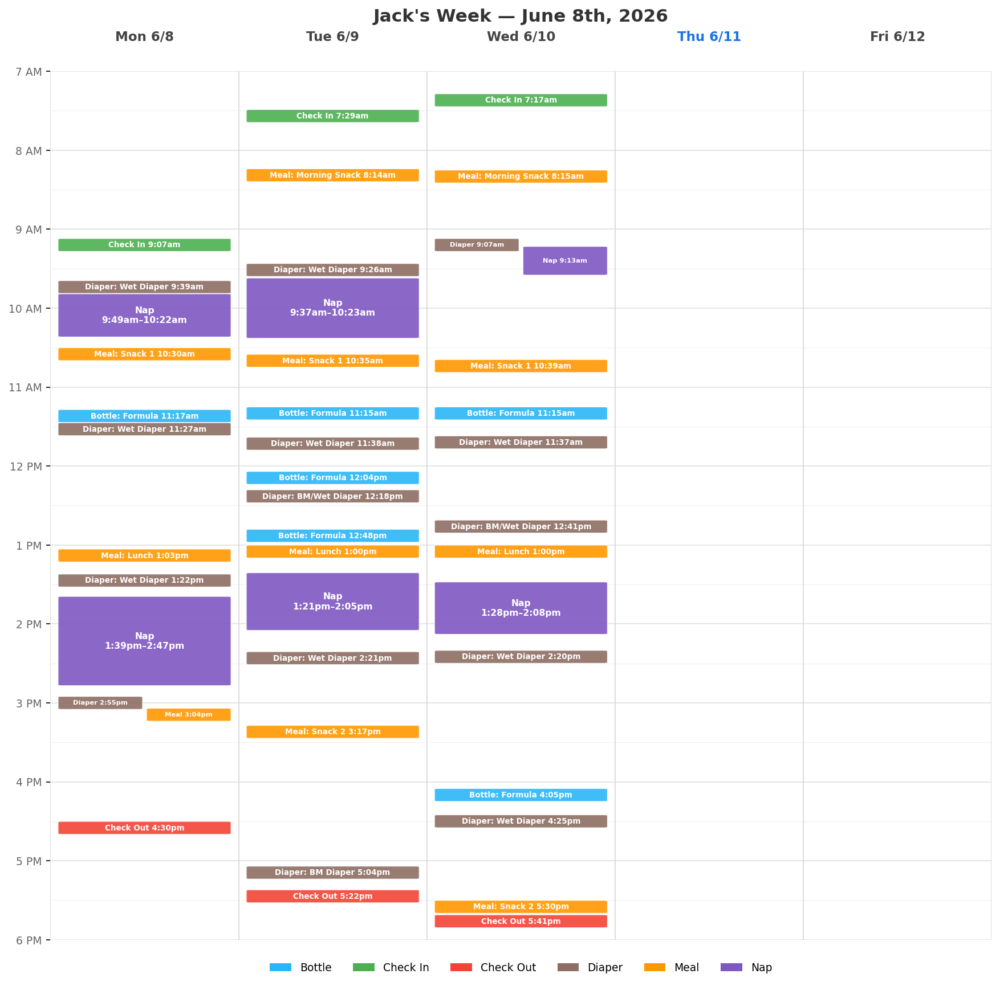

# jacks-daycare-log

Daily daycare logs for Jack, plus auto-generated weekly calendar views.

## This week



## How it works

- `daycare_log.csv` holds the daily events (check in/out, naps, meals, bottles, diapers).
- `scripts/generate_weekly_calendar.py` turns each week of data into a
  calendar-style image in `weekly_views/`, named after the Monday of that
  week (e.g. `June 8th.png`). Naps span their real duration; events with no
  end time are drawn as 10-minute blocks. Each action type has its own color,
  and overlapping events are laid out side by side.
- The **Generate weekly calendar views** GitHub Action
  (`.github/workflows/weekly-calendar.yml`) re-runs the script whenever
  `daycare_log.csv` changes on `main` and commits the updated PNGs, so the
  current week's image grows day by day. When the log rolls into a new week,
  a new PNG (e.g. `June 15th.png`) is created automatically.
- `weekly_views/latest.png` is always a copy of the most recent week.

To regenerate locally:

```bash
pip install matplotlib
python scripts/generate_weekly_calendar.py
```
